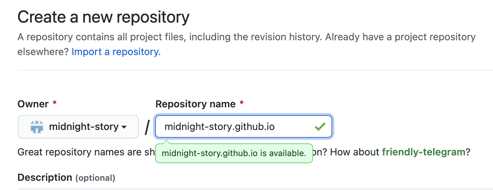

# Introduction to Programming

# Welcome!
<iframe src="https://giphy.com/embed/UtzyBJ9trryNO4R3Ee" width="480" height="416" frameBorder="0" class="giphy-embed" allowFullScreen></iframe>

# Agenda
* Welcome! (14:00-14:05)
* Introduction round (14:05-14:15)
* Introduction to Programming (14:15-15:00)
* Hands on HTML & CSS (15:00-15:30)
* Q&A (15:30-15:50)
* Resources (15:50-16:00)

# Your expectations

# What are we going to create?

# Who am I?

# Who am I?

# Who am I?

# Who am I?

# Projects I have worked on
<iframe src="https://player.vimeo.com/video/472316891" width="640" height="360" frameborder="0" allow="autoplay; fullscreen; picture-in-picture" allowfullscreen></iframe>

<a href="https://vimeo.com/472316891">UNDER PRESSURE by Henrike Iglesias - Trailer</a>

# Who are you?
* What's your name?
* A funny fact about you?

<iframe src="https://giphy.com/embed/5L57f5fI3f2716NaJ3" width="480" height="360" frameBorder="0" class="giphy-embed" allowFullScreen></iframe>

# What is programming

# Programming explained by a 6-year old
https://twitter.com/fjsteele/status/434249935316615168

# What programming feels like

<iframe width="560" height="315" src="https://www.youtube.com/embed/cDA3_5982h8" title="YouTube video player" frameborder="0" allow="accelerometer; autoplay; clipboard-write; encrypted-media; gyroscope; picture-in-picture" allowfullscreen></iframe>

# You can try

https://blockly.games/maze

# What is a programming language?
* Bunch of rules which may control a computer
* They are similar to the natural languages but are with stricter rules

# What is code?
* Code is text written in a programming language
* When we write code, we communicate
* Sequence of commands and data

# Different programming languages

# Which programming language shall I learn

# Different types of applications

* Application = A type of software that enables the user to perform different tasks
* Different types of applications exist (web apps, mobile apps...)

# What language do I need for my type of app?

# Web-development

# Web-development Dictionary

* Web Server = A Web server is a computer system that hosts websites
* Client = The Browser
* Hosting = A place where you store all the files that make up your website and run them
* Domain name = Website's address on the world wide web
* User Interface (UI) =  The screens and interactive touchpoints that make up a website or an app
* User eXperience (UX) = All about providing a smooth, user-friendly experience for the end user as they navigate around a website or an app

# Client <-> Server communication

# Types of websites

* Static - always the same. if you want to make changes to its content, you do it in the code. you do not need logic and can be done by using just HTML and CSS
* Dynamic - Shablons, filled with data from the User interface, there may be interaction with the user. Needs logic with collects and aggregates the data if needed (example: a CMS)
* What we are going to do today falls in the first category

# A great resource for a start in web-development!

#### https://dusk.geo.orst.edu/gis/Google_Book_20Things.pdf

# Things that are good to have in mind

# Things that are good to have in mind

# Things that are good to have in mind

# Things that are good to have in mind

# Things that are good to have in mind

* Mistakes = Learning!
* Not knowing stuff is normal, the pros spend half their day googling for solutions
* Start with small steps, iterate over them and upgrade on every iteration
* Don't Panic!

# In HTML we trust!

# Text documents VS text editors

* Programs that are designed to edit plain text
* Some text editors offer additional help features such as automatically coloring the various special commands
* Word documents are not text files!
* You can think of Word for text is like Photoshop for an image

# How to make file extensions visible if they are not

* Windows: https://www.google.bg/search?q=windows+7+show+extensions+for+known+file+types
* Mac OS X: https://support.apple.com/bg-bg/guide/mac-help/mchlp2304/mac

# The basic building blocks of the web

* HTML
* CSS

# HTML

* Not a programming language
* Markup language for creating Web pages
* Tells browsers how to lay out and present content on a web page
* Consists of a series of elements
* Elements label pieces of content such as "this is a heading", "this is a paragraph", "this is a link", etc.

# CSS

* Unlike HTML, which is concerned with the meaning of the content, CSS is presentational: it's concerned with how that content should look
* Not a programming language
* Evolution of a web page: https://jgthms.com/web-design-in-4-minutes/
* Play around with http://www.csszengarden.com/

# Show time!

# Let's get our hands dirty
* Fire up your text editor
* Create a HTML document
* Type "Hello World" within the HTML document you just created
* Save the file some place you'll be able to find easily, like your Desktop

PS: After the workshop you can go through a more detailed guide here: http://docs.railsbridge.org/frontend/introduction_to_html

# Open the file in the browser
* Click twice on the file
* Even though your file does not include any HTML tags yet, browsers are great at showing text on screen, so your browser will just show you your text.

# First tag!

* Update the contents of your hello.html file to look like this

~~~~~~~~~~~~~~~~~~~~~~~~~~~~ .html
Hello <i>World</i>!
~~~~~~~~~~~~~~~~~~~~~~~~~~~~

* Save the file and refresh the browser

# HTML is Tags

~~~~~~~~~~~~~~~~~~~~~~~~~~~~
Opening tag: <i>
Content: Hello world!
Closing tag: </i>
~~~~~~~~~~~~~~~~~~~~~~~~~~~~

#### All these things combined are called an HTML element:

# Let's introduce ourselfs

* On a new line introduce yourself

~~~~~~~~~~~~~~~~~~~~~~~~~~~~ .html
Hello <i>World</i>!
My name is Sophia!
~~~~~~~~~~~~~~~~~~~~~~~~~~~~

* Save the file and refresh the browser

# Let's add structure

* Lets update our first row with <strong>header 1</strong> tag and our introduction to be in <strong>paragraph</strong> tag

~~~~~~~~~~~~~~~~~~~~~~~~~~~~ .html
<h1>Hello <i>World</i>!</h1>

My name is Sophia!

~~~~~~~~~~~~~~~~~~~~~~~~~~~~

* It's common for an HTML tag to be nested inside another tag
* Save the file and refresh the browser

# Tags for Every Occasion
##### You don't need to memorize all the tags! You can always look them up on sites like

* https://developer.mozilla.org/en/HTML/Element

# Pages, Like People, Have a Head and a Body

~~~~~~~~~~~~~~~~~~~~~~~~~~~~ .html
<html>
  <head>
    <!-- Important invisible details will go here! -->
  </head>
  <body>
    Visible Content
  </body>
</html>
~~~~~~~~~~~~~~~~~~~~~~~~~~~~

# The Head
#### Contains information that is not displayed directly but influences the page
#### Examples:
* What language or character set you're using:

~~~~~~~~~~~~~~~~~~~~~~~~~~~~ .html
<meta charset="utf-8">
~~~~~~~~~~~~~~~~~~~~~~~~~~~~

* What the page title should be:

~~~~~~~~~~~~~~~~~~~~~~~~~~~~ .html
<title>My awesome page!</title>
~~~~~~~~~~~~~~~~~~~~~~~~~~~~

* What CSS and JavaScript files to include (and where they are):

~~~~~~~~~~~~~~~~~~~~~~~~~~~~ .html
<link rel="stylesheet" href="style.css">
~~~~~~~~~~~~~~~~~~~~~~~~~~~~

# The Body

* The actual content of your file.
* The things you'll want your users to be able to see, read, or interact with.
* Until now we were writing content for our body

# Let's add head and body to our file

* In addition to the <strong>head</strong> and <strong>body</strong> tags the whole code should be in a <strong>html</strong> tag in order the file to be valid.
* Let's add the html, head, and body tags to our index.html file.

~~~~~~~~~~~~~~~~~~~~~~~~~~~~ .html
<html>
  <head>
  </head>
  <body>
    <h1>Hello <i>World</i>!</h1>
    
My name is Sophia!

  </body>
</html>
~~~~~~~~~~~~~~~~~~~~~~~~~~~~

# Who likes burocracy...

#### One more final step separates us from the valid file

~~~~~~~~~~~~~~~~~~~~~~~~~~~~ .html
<!DOCTYPE html>
~~~~~~~~~~~~~~~~~~~~~~~~~~~~
* It tells the browser which version of HTML you're using
* It should stay on top of all the code

~~~~~~~~~~~~~~~~~~~~~~~~~~~~ .html
<!DOCTYPE html>
<html>
  <head>
  </head>
  <body>
    <h1>Hello <i>World</i>!</h1>
    
My name is Sophia!

  </body>
</html>
~~~~~~~~~~~~~~~~~~~~~~~~~~~~

# Let's add a bit of style

#### CSS Rules Are Made of a Selector and Attributes

# Style tags

* We're going to add our CSS inside the <strong>head</strong> tag
* This is not a good practice and it is preffered that a separate css file is created

#### A style tag looks like this

~~~~~~~~~~~~~~~~~~~~~~~~~~~~ .html

~~~~~~~~~~~~~~~~~~~~~~~~~~~~

#### And the whole code update with the style tag:

~~~~~~~~~~~~~~~~~~~~~~~~~~~~ .html
<!DOCTYPE html>
<html>
  <head>
    
  </head>
  <body>
    <h1>Hello <i>World</i>!</h1>
    
My name is Sophia!

  </body>
</html>
~~~~~~~~~~~~~~~~~~~~~~~~~~~~

# Let's add CSS... finally

#### CSS code looks like

~~~~~~~~~~~~~~~~~~~~~~~~~~~~ .html
p {
  padding: 10px;
  background-color: papayaWhip;
}
~~~~~~~~~~~~~~~~~~~~~~~~~~~~

#### And we are going to add it in the style tag
~~~~~~~~~~~~~~~~~~~~~~~~~~~~ .html
<!DOCTYPE html>
<html>
  <head>
    
  </head>
  <body>
    <h1>Hello <i>World</i>!</h1>
    
My name is Sophia!

  </body>
</html>
~~~~~~~~~~~~~~~~~~~~~~~~~~~~

# Congrats! We are ready with our website!

# Let's celebrate with putting it online where everyone can access it!

* Create a repository in GitHub: https://github.com/new
* name your repository: <strong>yourgithubusername</strong>.github.io

PS: More information about GitHub pages you can find here: https://pages.github.com/

# Q&A

# Resources

#### Web Development

* https://dusk.geo.orst.edu/gis/Google_Book_20Things.pdf
* https://www.codecademy.com/catalog/subject/web-development
* http://www.freecodecamp.com/

#### HTML&CSS

* http://learn.shayhowe.com/
* https://jgthms.com/web-design-in-4-minutes/

#### CSS

* http://www.csszengarden.com/
* http://flukeout.github.io/ 
* http://book.mixu.net/css/index.html
* https://yoksel.github.io/flex-cheatsheet/
* http://howtocenterincss.com/
* http://cssreference.io/

# And even more resources...

#### A good read

https://www.thinkful.com/blog/why-learning-to-code-is-so-damn-hard/

#### Ruby

* http://ruby.learncodethehardway.org/book/
* https://try.ruby-lang.org/
* https://www.rubymonk.com/
* http://ruby-for-beginners.rubymonstas.org/
* https://www.codecademy.com/catalog/language/ruby
* http://www.gotealeaf.com/books/ruby
* http://tutorials.jumpstartlab.com/projects/ruby_in_100_minutes.html

#### Ruby on Rails

* https://www.railstutorial.org/
* http://railsforzombies.org/

#### GitHub Pages

* https://pages.github.com/
* https://medium.com/swlh/how-to-host-your-website-on-github-pages-for-free-3302b0fe8956

#### Study groups and events:

* http://railsgirls.com/events.html
* https://rorganize.it/groups?utf8=%E2%9C%93&city=Berlin
* https://www.bridgetroll.org/
* https://www.codecurious.org/

#### System administration

* https://sysadmin.it-landscape.info/

